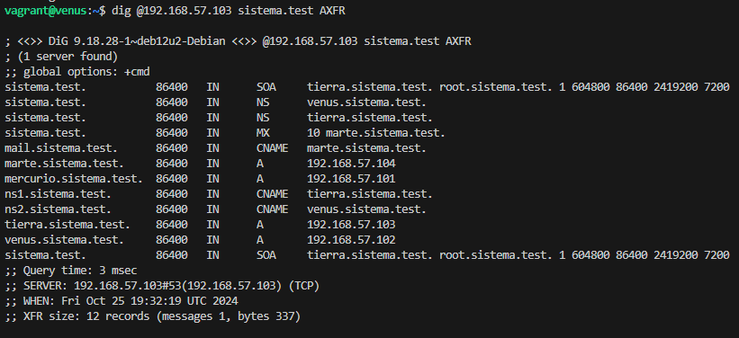
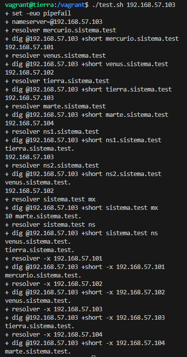

# Proyecto DNS

Creación de un servidor maestro (tierra) y un servidor esclavo (venus) y su posterior configuración.

## Tabla de Contenidos

- [Introducción](#Introducción)
- [Características](#Características)
- [Archivos](#Archivos)
- [Tecnologías Utilizadas](#Tecnologías-utilizadas)
- [Instalación](##Instalación)
- [Pruebas](#Pruebas)
- [Licencia](#Licencia)
- [Autor](#Autor)

## Introducción

El proyecto se ha creado siguendo las indicaciones del pdf aportado. Se han creado los diferentes servidores, estableciendo tierra como maestro, venus como esclavo, mercurio como imaginario (Linux gráfico) y marte como imaginario (Windows gráfico).

## Características

- Linux gráfico (imaginario en esta práctica)--------------------------------------mercurio.sistema.test .101
- Debian texto --------------------------------------------------------------------venus.sistema.test .102 (esclavo)
- Debian texto --------------------------------------------------------------------tierra.sistema.test .103 (maestro)
- Windows gráfico o server (imaginario en esta práctica)---------------------------marte.sistema.test .104

### IPv4.
    ```
    OPTIONS="-u bind -4"
    ```
### dnssec-validation
    ```
    dnssec-validation yes;
    ```

### Consultas recursivas solo mediante la red 127.0.0.0/8 y la red 192.168.57.0/24 usando acl.
    ```
    acl "confiables" {
    127.0.0.0/8;
    192.168.57.0/24;
};
    ```

### Tiempo en caché de las respuestas negativas - 7200 segundos.
    ```
    7200 	; Negative Cache TTL

    ```

### Consultas no autorizadas reenviadas al servidor DNS 208.67.222.222 (OpenDNS).
    ```
    forwarders {
        208.67.222.222;
    };

    forward only;
    ```

### ns1.sistema.test. es alias de tierra.sistema.test.
```
ns1         IN  CNAME   tierra.sistema.test.
```

### ns2.sistema.test. es alias de venus.sistema.test.
```
ns2         IN  CNAME   venus.sistema.test.
```

### mail.sistema.test. es alias de marte.sistema.test.
```
mail        IN  CNAME   marte.sistema.test.
```

### marte.sistema.test. es servidor de correo de sistema.test.
```
@					IN  MX  10 marte.sistema.test. 
```


## Tecnologías Utilizadas

Enumera las tecnologías, lenguajes de programación y herramientas que se utilizan en el proyecto:

- **Herramienta de entorno de desarrollo 1**: Visual Studio Code.
- **Herramienta de entorno de desarrollo 2**: Vagrant.
- **Herramienta de alojamiento de proyectos**: GitHub.


## Archivos

### Vagrantfile

```
# -*- mode: ruby -*-
# vi: set ft=ruby :

Vagrant.configure("2") do |config|
  config.vm.box = "debian/bookworm64"
  # config.vbguest.auto_update = false
  config.vm.provision "shell", name: "update", inline: <<-SHELL
      apt-get update
      apt-get install -y bind9
    SHELL

  config.vm.define "tierra" do |tierra|
    tierra.vm.hostname = "tierra.sistema.test"
    tierra.vm.network "private_network", ip: "192.168.57.103"

    tierra.vm.provision "shell", name: "dns-master", inline: <<-SHELL
      cp -v /vagrant/named /etc/default
      cp -v /vagrant/named.conf.options /etc/bind
      cp -v /vagrant/named.conf.localmaster /etc/bind/named.conf.local
      cp -v /vagrant/sistema.test.dns /etc/bind
      cp -v /vagrant/192.168.57.dns /etc/bind
      cp -v /vagrant/resolv.conf /etc/resolv.conf
      systemctl reload named
      systemctl status named
    SHELL
  end # master

  config.vm.define "venus" do |venus|
    venus.vm.hostname = "venus.sistema.test"
    venus.vm.network "private_network", ip: "192.168.57.102"

    venus.vm.provision "shell", name: "dns-slave", inline: <<-SHELL
      cp -v /vagrant/named /etc/default
      cp -v /vagrant/named.conf.options /etc/bind
      cp -v /vagrant/named.conf.localslave /etc/bind/named.conf.local
      systemctl reload named
      systemctl status named
    SHELL
  end # slave
end

```

### named

```
#
# run resolvconf?
RESOLVCONF=no

# startup options for the server
OPTIONS="-u bind -4"

```

### named.conf.localmaster

```
//
// Do any local configuration here
//

// Consider adding the 1918 zones here, if they are not used in your
// organization
//include "/etc/bind/zones.rfc1918";


zone "sistema.test" {
    type master;
    file "/etc/bind/sistema.test.dns";
    allow-transfer {192.168.57.102;};
};

zone "57.168.192.in-addr.arpa" {
    type master;
    file "/etc/bind/192.168.57.dns";
    allow-transfer {192.168.57.102;};
};

```

### named.conf.localslave

```

//
// Do any local configuration here
//

// Consider adding the 1918 zones here, if they are not used in your
// organization
//include "/etc/bind/zones.rfc1918";


zone "sistema.test" {
    type slave;
    file "/etc/bind/sistema.test.dns";
    masters { 192.168.57.103; };
};

zone "57.168.192.in-addr.arpa" {
    type slave;
    file "/etc/bind/192.168.57.dns";
    masters { 192.168.57.103; }; 
};

```

### named.conf.options

```
acl "confiables" {
    127.0.0.0/8;
    192.168.57.0/24;
};

options {
	directory "/var/cache/bind";

	// If there is a firewall between you and nameservers you want
	// to talk to, you may need to fix the firewall to allow multiple
	// ports to talk.  See http://www.kb.cert.org/vuls/id/800113

	// If your ISP provided one or more IP addresses for stable 
	// nameservers, you probably want to use them as forwarders.  
	// Uncomment the following block, and insert the addresses replacing 
	// the all-0's placeholder.


	recursion yes;  
    allow-recursion { confiables;};
    allow-query { confiables;};
    allow-transfer { confiables;};


	forwarders {
        208.67.222.222;
    };

    forward only;

	//========================================================================
	// If BIND logs error messages about the root key being expired,
	// you will need to update your keys.  See https://www.isc.org/bind-keys
	//========================================================================
	
	dnssec-validation yes;

	listen-on port 53 { confiables;};
	listen-on-v6 { none;};
	listen-on {any;};

	
};

```

### sistema.test.dns

```
; sistema.test
;
$TTL	86400
$ORIGIN sistema.test.
@	IN	SOA	tierra.sistema.test. root.sistema.test. (
			      1		; Serial
			 604800		; Refresh
			  86400		; Retry
			2419200		; Expire
			   7200 )	; Negative Cache TTL
;
@					IN	NS	tierra.sistema.test.
@					IN	NS	venus.sistema.test.
@					IN  MX  10 marte.sistema.test. 

tierra      IN  A    192.168.57.103
venus       IN  A    192.168.57.102
marte       IN  A    192.168.57.104
mercurio    IN  A    192.168.57.101

ns1         IN  CNAME   tierra.sistema.test.
ns2         IN  CNAME   venus.sistema.test.
mail        IN  CNAME   marte.sistema.test.

```

### 192.168.57.dns

```
;57.168.192
;
$TTL	604800
$ORIGIN 57.168.192.in-addr.arpa.
@	IN	SOA	tierra.sistema.test. root.sistema.test. (
			      1		; Serial
			 604800		; Refresh
			  86400		; Retry
			2419200		; Expire
			   7200 )	; Negative Cache TTL 
;
@								IN	NS	tierra.sistema.test.

101 IN  PTR mercurio.sistema.test.
102 IN  PTR venus.sistema.test.
103 IN  PTR tierra.sistema.test.
104 IN  PTR marte.sistema.test.

```

### .gitignore

```
.vagrant/

```

## Instalación

Para llevar a cabo la intalación de los servidores será necesario disponer de una herramienta como Visual Studio Code, clonar el repositorio y realizar vagrant up para lanzarlo.

### Requisitos Previos

- Disponer de Visual Studio Code o similar.
- Disponer de GitHub.
- Disponer de Vagrant.

### Pasos de Instalación

1. Abrir Visual Studi Code.

2. Navegar al directorio del proyecto
   cd proyecto

3. Clonar el repositorio:
   ```powershell
   git clone https://github.com/AlvaroMGDrui/DNS

4. Arrancar los servidores:
   ```powershell
   vagrant up

## Pruebas

Consultas con dig y nslookup

### Se resuelven los regsitros tipo A correctamente.
```
dig A mercurio.sistema.test
dig A venus.sistema.test
dig A tierra.sistema.test
dig A marte.sistema.test

nslookup mercurio.sistema.test
nslookup venus.sistema.test
nslookup tierra.sistema.test
nslookup marte.sistema.test
```

### Se resuelven de forma inversa sus direcciones IP.
```
dig -x 192.168.57.101
dig -x 192.168.57.102
dig -x 192.168.57.103
dig -x 192.168.57.104

nslookup 192.168.57.101
nslookup 192.168.57.102
nslookup 192.168.57.103
nslookup 192.168.57.104
```

### Se resuelven los alias de forma correcta.
```
dig ns1.sistema.test
dig ns2.sistema.test

nslookup ns1.sistema.test
nslookup ns2.sistema.test
```

### Se obtienen los servidores NS de sistema.test.
```
dig NS sistema.test

nslookup -type=NS sistema.test
```
### Se obtienen los servidores MX de sistema.test.
```
dig MX sistema.test

nslookup -type=MX sistema.test
```

### Se ha realizado la transferencia de la zona entre el servidor DNS maestro y el esclavo mediante AXFR de forma correcta.
Desde venus
```
dig @192.168.57.103 sistema.test AXFR

```




- Tanto maestro como esclavo son capaces de responder a las mismas preguntas.

### Test.sh



## Licencia

Attribution 4.0 International

## Autor

Álvaro Muñoz García
mugar.alvaro@gmail.com